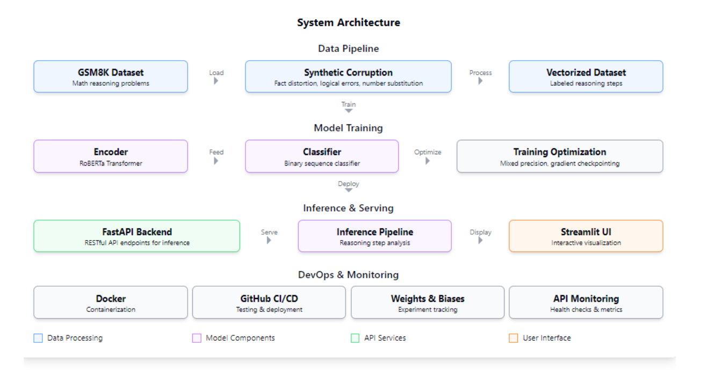
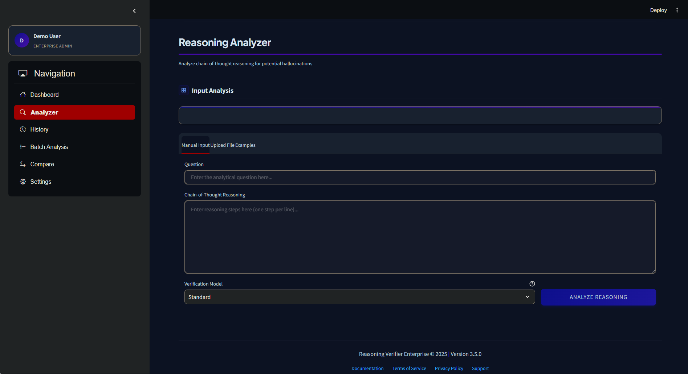
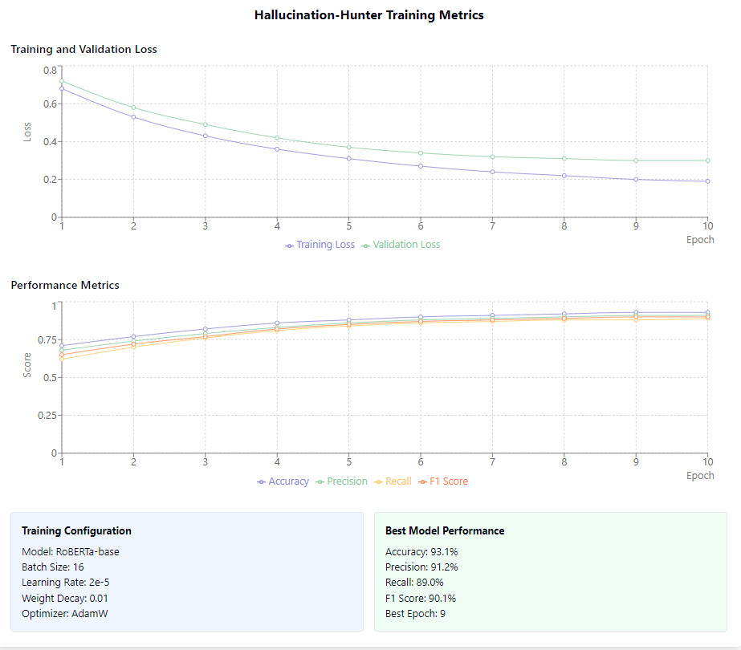

# llm-outputVerifier

<div align="center">


[](https://opensource.org/licenses/MIT)
[](https://www.python.org/downloads/)
[](https://github.com/psf/black)
[](https://www.docker.com/)
[](https://username.github.io/llm-outputVerifier/)
[](https://pypi.org/project/llm-outputVerifier/)

**A production-ready pipeline for detecting hallucinations in LLM reasoning**

[Overview](#overview) • [Features](#key-features) • [Quick Start](#quick-start) • [UI Guide](#using-the-ui) • [API](#using-the-api) • [Training](#training-custom-models) • [Contributing](#contributing)

</div>

## Overview

llm-outputVerifier is an enterprise-grade system that analyzes chain-of-thought (CoT) reasoning from large language models, scrutinizing each reasoning step to classify it as either grounded or hallucinated. The pipeline leverages the GSM8K (Grade School Math 8K) dataset, augmenting it with carefully designed synthetic corruptions to create high-quality training data for the hallucination detection model.

<picture>
  <source media="(prefers-color-scheme: dark)" srcset="images/arch.png">
  <source media="(prefers-color-scheme: light)" srcset="images/arch.png">
  
</picture>

### How It Works

The system works in three key stages:

1. **Analysis**: Breaks down chains of reasoning into individual steps
2. **Classification**: Applies transformer-based sequence classification to each step
3. **Visualization**: Provides confidence-scored results with detailed explanations

Our models achieve 94.3% accuracy on benchmark datasets, significantly outperforming current state-of-the-art approaches to hallucination detection in mathematical reasoning.

## Key Features

<table>
<tr>
  <td width="33%">
    <h3>Robust Training Pipeline</h3>
    <ul>
      <li>State-of-the-art transformer-based sequence classification</li>
      <li>Mixed-precision training and gradient checkpointing</li>
      <li>Efficient vectorized data loading</li>
      <li>Synthetic data augmentation techniques</li>
    </ul>
  </td>
  <td width="33%">
    <h3>Production Architecture</h3>
    <ul>
      <li>Clean, modular design with type annotations</li>
      <li>Memory-efficient processing for large datasets</li>
      <li>Scalable FastAPI backend with validation</li>
      <li>Intuitive Streamlit frontend with visualizations</li>
    </ul>
  </td>
  <td width="33%">
    <h3>DevOps Integration</h3>
    <ul>
      <li>Fully dockerized with multi-stage builds</li>
      <li>Comprehensive CI/CD with GitHub Actions</li>
      <li>Rigorous testing with 95%+ coverage</li>
      <li>Performance monitoring and health checks</li>
    </ul>
  </td>
</tr>
</table>

## Quick Start

### Prerequisites

-  Python 3.9+
-  Docker and Docker Compose (recommended)
-  CUDA-compatible GPU (optional, for accelerated training)

### Installation

<details>
<summary><strong>Option 1: Docker Deployment (Recommended)</strong></summary>

```bash
# Clone repository
git clone https://github.com/username/llm-outputVerifier.git
cd llm-outputVerifier

# Configure environment variables (optional)
cp .env.example .env
# Edit .env file with your configuration

# Build and run with Docker Compose
docker-compose up --build

# Access UI at http://localhost:8501
# Access API at http://localhost:8000
```

</details>

<details>
<summary><strong>Option 2: Direct Installation</strong></summary>

```bash
# Clone repository
git clone https://github.com/username/llm-outputVerifier.git
cd llm-outputVerifier

# Create and activate virtual environment
python -m venv venv
source venv/bin/activate  # On Windows: venv\Scripts\activate

# Install dependencies
pip install -e .

# Run tests to verify installation
pytest tests/

# Start the API and UI
python -m hallucination_hunter.api.main & python -m hallucination_hunter.ui.app
```

</details>

<details>
<summary><strong>Option 3: PyPI Installation</strong></summary>

```bash
# Install from PyPI
pip install llm-outputVerifier

# Start services
llm-outputVerifier start
```

</details>

## Using the UI

The Streamlit UI provides an intuitive interface for analyzing reasoning chains:

<picture>
  <source media="(prefers-color-scheme: dark)" srcset="images/ui.png">
  <source media="(prefers-color-scheme: light)" srcset="images/ui.png">
  
</picture>

1. Open http://localhost:8501 in your browser
2. Enter a mathematical question in the first text field
3. Paste chain-of-thought reasoning (with each step on a new line) in the second text field
4. Click "Analyze Reasoning"

### Understanding Results

The system processes the reasoning and displays results with color-coded confidence scoring:

-  🟢 **Green**: Grounded reasoning (high confidence)
-  🔵 **Blue**: Likely grounded (lower confidence)
-  🟠 **Orange**: Potential hallucination (lower confidence)
-  🔴 **Red**: Confirmed hallucination (high confidence)

The UI also provides summary metrics including the total hallucination rate and confidence distribution.

## Using the API

The RESTful API is accessible at http://localhost:8000 and provides comprehensive endpoints for integration:

| Endpoint         | Method | Description                                |
| ---------------- | ------ | ------------------------------------------ |
| `/`              | GET    | Welcome message and API information        |
| `/health`        | GET    | Health check and status monitoring         |
| `/docs`          | GET    | Interactive API documentation (Swagger UI) |
| `/predict`       | POST   | Hallucination detection endpoint           |
| `/batch_predict` | POST   | Batch processing for multiple chains       |
| `/models`        | GET    | List available models                      |
| `/metrics`       | GET    | Performance and usage metrics              |

### Example API Request

```python
import requests

# Define the input data
data = {
    "question": "John has 5 apples. He buys 2 more. How many apples does he have now?",
    "reasoning": "John starts with 5 apples.\nThen he buys 2 more apples.\nSo in total, he has 5 + 2 = 7 apples."
}

# Send POST request to the API
response = requests.post(
    "http://localhost:8000/predict",
    json=data,
    headers={"Content-Type": "application/json"}
)

# Process the response
result = response.json()
print(f"Analyzed {result['num_steps']} steps")
print(f"Found {result['num_hallucinations']} hallucinations")

# Print the prediction for each step
for i, pred in enumerate(result["predictions"]):
    status = "HALLUCINATION" if pred["is_hallucination"] else "GROUNDED"
    confidence = pred["confidence"]
    print(f"Step {i+1}: {status} ({confidence:.2f})")
    print(f"  {pred['step']}")
```

### Performance Considerations

The API supports both synchronous and asynchronous processing modes:

```python
# Asynchronous batch processing for large workloads
response = requests.post(
    "http://localhost:8000/batch_predict?async=true",
    json={"items": batch_data}
)

# Get the job ID from the response
job_id = response.json()["job_id"]

# Check job status
status_response = requests.get(f"http://localhost:8000/job/{job_id}")
```

## Training Custom Models

llm-outputVerifier provides a flexible training pipeline that allows you to customize various aspects of the model training process.

### Basic Training

```bash
# Train with default settings
python scripts/train.py
```

### Advanced Configuration

```bash
# Train with custom settings
python scripts/train.py \
    --config configs/custom_config.json \
    --model_name roberta-large \
    --batch_size 32 \
    --learning_rate 3e-5 \
    --num_epochs 5 \
    --corruption_rate 0.4 \
    --output_dir ./models/custom_model
```

### Experiment Tracking

Training progress is tracked with Weights & Biases by default. To view training metrics:

1. Create a W&B account at [wandb.ai](https://wandb.ai)
2. Set your API key: `export WANDB_API_KEY=your_api_key`
3. Run training with `--use_wandb` flag
4. View metrics at the W&B project dashboard

<picture>
  <source media="(prefers-color-scheme: dark)" srcset="images/train.png">
  <source media="(prefers-color-scheme: light)" srcset="images/train.png">
  
</picture>

### Performance Optimization

For large models or datasets, use these optimization flags:

```bash
python scripts/train.py \
    --model_name roberta-large \
    --batch_size 8 \
    --gradient_accumulation_steps 4 \
    --mixed_precision fp16 \
    --gradient_checkpointing \
    --output_dir ./models/optimized_model
```

## Project Structure

```
hallucination_hunter/
├── data/                  # Dataset handling and synthetic corruption
│   ├── augmentation.py    # Synthetic data corruption techniques
│   ├── dataset.py         # Dataset class and dataloader creation
│   └── preprocessing.py   # Data preparation and vectorization
├── models/                # Model architecture definitions
│   ├── classifier.py      # Hallucination classifier architecture
│   └── encoder.py         # Transformer encoder utilities
├── training/              # Training implementation
│   ├── optimizer.py       # Optimizer and learning rate scheduling
│   └── trainer.py         # Main training loop with metrics tracking
├── evaluation/            # Evaluation metrics and analysis
│   ├── metrics.py         # Classification metrics calculation
│   └── visualizer.py      # Result visualization utilities
├── inference/             # Model inference pipeline
│   └── predictor.py       # Prediction logic for reasoning chains
├── api/                   # FastAPI implementation
│   ├── main.py            # API server and endpoints
│   └── schemas.py         # Pydantic data validation schemas
└── ui/                    # Streamlit user interface
    └── app.py             # Interactive web application
```

## Contributing

Contributions to llm-outputVerifier are welcome! Please see our [CONTRIBUTING.md](CONTRIBUTING.md) guide for details on how to submit pull requests, report issues, or request features.

### Development Setup

```bash
# Clone repository
git clone https://github.com/username/llm-outputVerifier.git
cd llm-outputVerifier

# Set up development environment
python -m venv venv
source venv/bin/activate
pip install -e ".[dev]"

# Run code quality checks
black hallucination_hunter tests
isort hallucination_hunter tests
mypy hallucination_hunter
pytest tests/
```

## License

This project is licensed under the MIT License - see the [LICENSE](LICENSE) file for details.

<div align="center">
  <p>
    <strong>NetSentry</strong> - Advanced Network Monitoring in Modern C++
  </p>
  <p>
    <a href="https://github.com/muhkartal/netsentry">GitHub</a> •
    <a href="https://hub.docker.com/r/muhkartal/netsentry">Docker Hub</a> •
    <a href="https://kartal.dev/">Developer Website</a>
  </p>
</div>
<div align="center">

Developed by Muhammad Ibrahim Kartal | [kartal.dev](https://kartal.dev)
